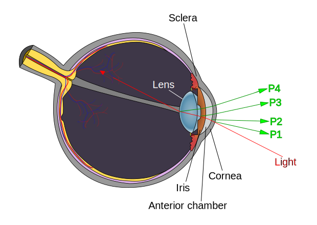

# Notes

### Excerpt from paper

- "calibration process produces two different matrices for each eye."
    - ```Mat left[n][m]```
- "The matrices are being computed by linear interpolation of the
measurements obtained during calibration."

##### Hardware

- "For each eye that
we have a ***pupil and CR detection*** we measure the length and the angle of their distance."
    (CR: Cornea Reflection)

##### Algorithm & Parameters

- "A critical parameter of the eye tracking analysis is to identify and estimate the position and
***duration of fixations***. To constitute a fixation, gaze points have to remain within a window of size $d _{max}$ for
at least $t _{min}$ .
In our analysis, we empirically determined that **t min = 90ms and d max = 45pixels, corresponding to 1.5$^\text{o}$**, work well for identifying fixations across all participants"
- 

### Resources & Open Source Repos
- [openeyetracker](https://open-neuroscience.com/post/openeyetrack_an_open_source_high_speed_eyetracker/)
- [PyGaze](http://www.pygaze.org/)

### Important terms & notes
- Purkinje images (eye structure image)
    - 
- CR (Cornea Reflection)
- saccadic movement (point-to-point movement within short period, avg 200-480ms)
- [medotics AG eye tracking](http://medotics.com/metsio.php)
- Gaze detection
    - [Pupil labs](http://www.pygaze.org/) cheapest option $2740 euro
    - Tobii eye tracker
    - NVGaze

### Challenges

- lack of IR emitter & receiver
- need a good webcam in considerably small form factor in order to place it in an unobstructing position

### To-dos

- eye-tracking program
- GUI
- eye-movement (reading quality) analysis, with charts and graph

### Algo

1. track face-eye position on screen 
    - Haar Cascade for detecting eye location on camera
        - need to train my own? prebuilt in opencv not stable
2. calibrate eye movement with screen dimension
    - grayscale thresholding to find pupil

### OpenCV

#### functions
- cv.CascadeClassifier.detectMultiScale
  - 
